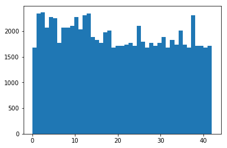

#**Traffic Sign Recognition** 

---

**Build a Traffic Sign Recognition Project**

The goals / steps of this project are the following:
* Load the data set (see below for links to the project data set)
* Explore, summarize and visualize the data set
* Design, train and test a model architecture
* Use the model to make predictions on new images
* Analyze the softmax probabilities of the new images
* Summarize the results with a written report

## Rubric Points
###Here I will consider the [rubric points](https://review.udacity.com/#!/rubrics/481/view) individually and describe how I addressed each point in my implementation.  

---
###Writeup / README

####1. Provide a Writeup / 

I found that the most important issue is to know the potential of training(validation) data set. Since ultimate porpose is to predict unknown samples, if you have enough coverage of training datase against test dataset, that will cover whole probability to get high accuracy. 

###Data Set Summary & Exploration

####1. Provide a basic summary of the data set. In the code, the analysis should be done using python, numpy and/or pandas methods rather than hardcoding results manually.

I used the pandas library to calculate summary statistics of the traffic signs data set:
* Number of training examples = 12630
* Number of validation examples = 4410
* Number of testing examples = 34799
* Image data shape = (32, 32, 3)
* Number of classes = 43

####2. Include an exploratory visualization of the dataset.
Here is an exploratory visualization of the data set. It is a bar chart showing how the data. 

- There is big imbalance of data size: biggest = 750, smallest = 60)
- Brightness range is huge

###Design and Test a Model Architecture
####1. Describe how you preprocessed the image data.

* Firstly I set up base Archinecture (conv1: 5x5x16  maxpool conv2: 5x5x32 maxpool fc fc softmax    5 epochs)
* I tried RGB, and Network divergied and Validation accuracy was somewhere 0.05
* then, I tried normalization of RGB to scale down to range of [0-1] with 3 channel, => got ave. validation accuracy of 0.81
* RGB is 3 channels, so I also tried Gray and YUV-Y with range of [0-1], => got ave.  RGB 0.81, gray 0.83, YUV 0.84
* Also, I applied histgram adjustment each data, then got ave. YUV 0.91
* After result of above comparison, took YUV-Y
* at the same time, I tried below. but was not so helpful.
    - Contrast (high,low), 
    - Gamma transfer (high,low), 
    - Gaussian noise,
    - Smoothing,
    - Salt & Pepper
* Then I augmented training data (rotation, shift, shear zoom)

- YUV 

1. Contrast

2. Gamma

3. Gaussian_Noise

4. Smoothing

5. Salt & Pepper

* YUV images after augmentation

* Training set after Augmentation

####2. Describe what your final model architecture looks like including model type, layers, layer sizes, connectivity, etc.) Consider including a diagram and/or table describing the final model.

My final model consisted of the following layers:

| Layer         		|     Description	        					| 
|:---------------------:|:---------------------------------------------:| 
| Input         		| 32x32x1 YUV image   							| 
| Convolution 5x5     	| 1x1 stride, valid padding, outputs 28x28x16 	|
| RELU					|												|
| Max pooling	      	| 2x2 stride,  outputs 14x14x16 				|
| Convolution 5x5	    | 1x1 stride, valid padding, outputs 10x10x32	|
| RELU					|												|
| Max pooling	      	| 2x2 stride,  outputs 5x5x32 				    |
| Dropout				| 0.5											|
| Fully connected		| 800 x 128    									|
| RELU					|												|
| Softmax				| 128 x 43     									|
|						|												|
|						|												|
 

####3. Describe how you trained your model. The discussion can include the type of optimizer, the batch size, number of epochs and any hyperparameters such as learning rate.

- Weight Initialization
    - W: mu = zero
    - W: sigma = np.sqrt(2.0 / BATCH_SIZE)
    - b: zero

- Learning Rate
    - Learing rate = 0.001   (for faster learn, after trial of 0.00001 - 0.1)

- Activation Functions
    - ReLU 
    
- Network Topology
    - Input size = 32x32x1 = 1024
    - Output size = 43

- Batches and Epochs
    - BATCH_SIZE = 64        (for faster learn, higher frequency for delta adjustment but per loss amount is smaller)
    - EPOCHS = 50            (after trail, found 50 is enough in this model) 

- Regularization
    - Not embedded (because the accuracy seems stable during middle to last training session)
    
- Optimization and Loss
    - Optimizer = Adam       (because variance might be low compared with other optimizer)
    - Loss = Cross Entropy  (43 category classification)

- Early Stopping
    - Not embedded, since model is not so big

####4. Describe the approach taken for finding a solution and getting the validation set accuracy to be at least 0.93. Include in the discussion the results on the training, validation and test sets and where in the code these were calculated. Your approach may have been an iterative process, in which case, outline the steps you took to get to the final solution and why you chose those steps. Perhaps your solution involved an already well known implementation or architecture. In this case, discuss why you think the architecture is suitable for the current problem.

My final model results were:
* validation set accuracy of 0.950 (max 0.957)
* test set accuracy of 0.956

If an iterative approach was chosen:
* What was the first architecture that was tried and why was it chosen?
    - 3 color, simple structure model: to know the original data potential (low accuracy)
* What were some problems with the initial architecture?
    - Gray scaling or normalization did not help improvement
    - I tried twin type, wider kernel or deeper layer ones. but both didnt work because of gradiant vanish. (much lower accuracy)
    - from the point of structure, I found simpler one is compatible for this case (shape variance is low)
* How was the architecture adjusted and why was it adjusted? 
    - YUV converter: seemed data variance comes hugely from contrast or brightness
* Which parameters were tuned? How were they adjusted and why?
    - Batch size, sigma, learning rate : for faster learn
    - to take balance above, took dropout
* What are some of the important design choices and why were they chosen? 
    - I wanted to try batch-normalization... but I couldnt embedded in the network because of my math and coding skill...
    - Ultimate goal is to get high predicting capability against testing data, so I should have try cross-validation method.

If a well known architecture was chosen:
* What architecture was chosen?   
    - Google, Microsoft or other high-spec pretrained network.
* Why did you believe it would be relevant to the traffic sign application?
    - High recognition capability can be appicable to other cases
* How does the final model's accuracy on the training, validation and test set provide evidence that the model is working well?
    - Validation accuracy is nearly equal to Test accuracy 

###Test a Model on New Images

####1. Choose five German traffic signs found on the web and provide them in the report. For each image, discuss what quality or qualities might be difficult to classify.
  &
####2. Discuss the model's predictions on these new traffic signs and compare the results to predicting on the test set. At a minimum, discuss what the predictions were, the accuracy on these new predictions, and compare the accuracy to the accuracy on the test set (OPTIONAL: Discuss the results in more detail as described in the "Stand Out Suggestions" part of the rubric).

- Before & After Adjustment

>>>>>>>>>>
Prediction Result:  3/5 = 60% accuracy  (3/8 = 40% accuracy)

* When compared to test result, accuracy is quite low, because:

 for moderate shift, zoom, it was ok. but extreme case, not fit.
 In the real world the misunderstanding is really dangeraous (in this case (2) recognized 30km => 50km limit...)  
 Combined one is over capability for this model

  ==> I have to really notice this potential recognition limitation of my model (responsibility of autonomous vehicle/machine)

####3. Describe how certain the model is when predicting on each of the five new images by looking at the softmax probabilities for each prediction. Provide the top 5 softmax probabilities for each image along with the sign type of each probability. (OPTIONAL: as described in the "Stand Out Suggestions" part of the rubric, visualizations can also be provided such as bar charts)

Erred item (exclude new category or combined) :
* (2): 2nd selection, with quite slim margin
* (6): No entry in the list (traffic sign orientation is quite tilted)

==> Angle, Shift, Zoom, Occulation, Combination, Weather, Day/Night, Brightness/Darkness, Shadow, Mirror,  ,,, a lot of factors to be considered when you prepare NN

* I tried deeper network, but the new traffic sign recognition was too bad.  I think that is because of overfitting or shortage of learning.  I only have modest CPU pc, so I couldnot elaborate on this.  After getting GPU, I will back to this issue to confirm.

* Deeper model result (with Max Validation accuracy: 0.972, test accuracy: 0.938)

    *(Please refer to; Traffic_Sign_Classifier_001_YUV_norm(0-1)_AdHist_Augment_NewTest_Low)

### (Optional) Visualizing the Neural Network (See Step 4 of the Ipython notebook for more details)
####1. Discuss the visual output of your trained network's feature maps. What characteristics did the neural network use to make classifications?

